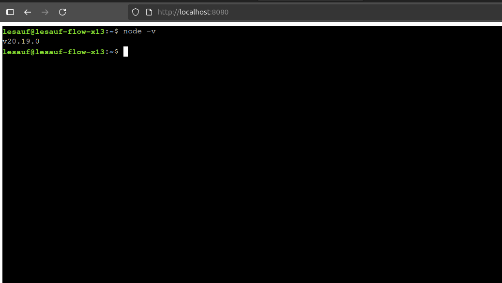

# Web Terminal

A lightweight, browser-based terminal application that provides access to a local terminal directly in your web browser. This project combines the power of xterm.js, Socket.IO, and node-pty to create a seamless terminal experience without requiring SSH.



<!-- Note: Add your screenshot to the assets/images directory and name it terminal-screenshot.png -->

## Features

- **Real-time Terminal Emulation**: Full terminal emulation in the browser
- **Responsive Design**: Terminal automatically resizes to fit your browser window
- **Cross-Platform**: Works on Windows, macOS, and Linux
- **Modern UI**: Clean interface with customizable terminal settings
- **Local Terminal Access**: Direct access to your local system's terminal (bash/powershell)

## Technologies Used

### Backend
- **Node.js**: JavaScript runtime for the server
- **Express**: Web server framework
- **Socket.IO**: Real-time bidirectional communication
- **node-pty**: Pseudo-terminal implementation

### Frontend
- **Angular**: Frontend framework
- **xterm.js**: Terminal emulator for the browser
- **Socket.IO Client**: Client-side real-time communication

## Installation

### Prerequisites
- Node.js (v18 or higher)
- npm (v6 or higher)

### Setup

1. Clone the repository:
   ```
   git clone https://github.com/lesauf/web-terminal.git
   cd web-terminal
   ```

2. Install server dependencies:
   ```
   cd server
   npm install
   ```

3. Install client dependencies:
   ```
   cd ../client
   npm install
   ```

## Usage

1. Start the server:
   ```
   cd server
   npm run dev
   ```

2. Start the client (in a new terminal window):
   ```
   cd ../client
   npm start
   ```

3. Open your browser and navigate to:
   ```
   http://localhost:8080
   ```

4. Start using the terminal directly in your browser!

## Architecture

The application follows a client-server architecture:

- **Server**: A Node.js application that:
  - Creates a pseudo-terminal using node-pty
  - Establishes Socket.IO connections with clients
  - Forwards terminal input/output between the pseudo-terminal and clients

- **Client**: An Angular application that:
  - Renders a terminal interface using xterm.js
  - Connects to the server using Socket.IO
  - Sends user input to the server
  - Displays terminal output from the server

## How It Works

1. When a user connects to the web application, the client establishes a Socket.IO connection with the server.
2. The server spawns a new pseudo-terminal process using node-pty.
3. User input from the browser is sent to the server via Socket.IO.
4. The server forwards this input to the pseudo-terminal.
5. Output from the pseudo-terminal is sent back to the client via Socket.IO.
6. The client renders this output in the xterm.js terminal.

## License

This project is licensed under the ISC License.

## Contributing

Contributions are welcome! Please feel free to submit a Pull Request.
